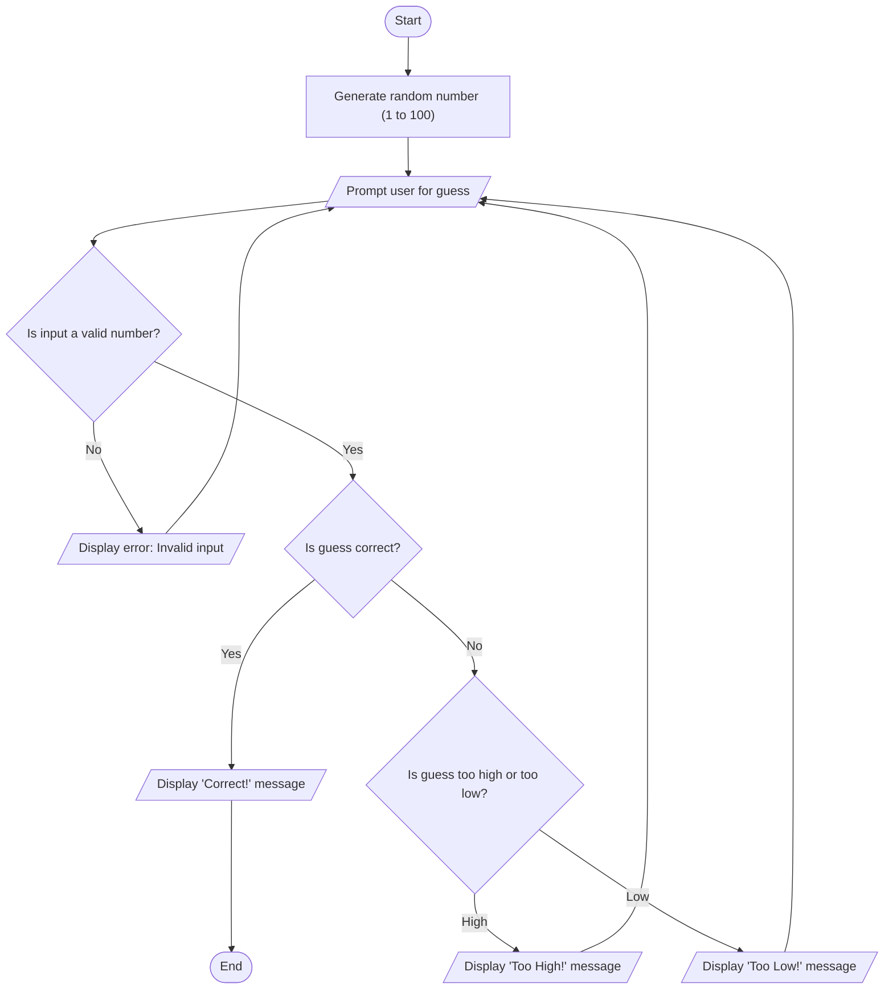

# Random Guessing Game Flowchart

**Start**: The game begins

**Generate Random Number**: The computer selects a random integer between 1 and 100, this number is stored and not shown to the user.

**Prompt User for Input**: The program asks the user to guess a number in the given range.

**Validate Input**: The program checks if the input is a valid number. If it's not, the program shows an error message and prompts the user again.

**Check Guess**: If the input is valid, the program checks if it matches the random number.

**Correct Guess**: If the guess is correct, a congratulatory message is shown and the game ends.

**Incorrect Guess**: If the guess is wrong, the program checks whether the guess is too high or too low. A corresponding message ("Too High!" or "Too Low!") is displayed. The user is then prompted to guess again.

**End**: The game terminates once the correct number is guessed.